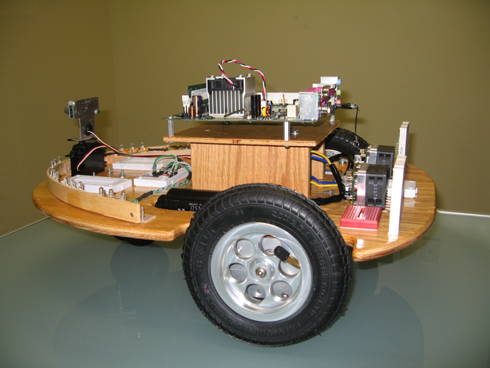

##############################
Designing PiBot using OpenSCAD
##############################

..  include::   /references.inc

After a few years of attempting to get my assembly language students to get my
project robot moving, I finally gave up on the current platform, and decided to
re-engineer the robot base. For this version, I am going to have a local
fabrication shop cut the basic robot frame out of sheet aluminum using a CNC
Water Jet machine. That fab shop needs a cad data file to drive the machine,
and can take almost any standard format as a starting point. After  looking
into some really cool 0but complex) tools, I decided to try something simple,
and easy for my beginning students to work with: OpenSCAD_.

Instead of using a fancy GUI based tool to draw the object we want to
manufacture, we describe it using a script. While this seems old-fashioned (it
is), it leads to a high degree of understanding into how the parts are shaped
and aligned to create the 3D object. This note will walk through the design of
the basic robot base.

***************
Getting started
***************

The existing base holds all the major components needed for my intended
application:

    * Parallax 12v wheels
    * Parallax Motor controllers
    * MiniITX Pentium motherboard
    * Raspberry i Cluster (4 boards)
    * Network hub for the cluster
    * 4 Teensy2 AVR controller stations for sensor projects
    * 12V power supply for main motors
    * 12v supply for Pentium motherboard
    * 5V supply for Raspberry PI cluster, and Teensy stations

In thinking about how to construct the platform, I decided to make it modular.
We will start off with a single assembly that holds the main drive motors and
associated power system. This component will serve as a base to which other
parts will be bolted to create the entire robot.

Here is a sketch showing the basic idea. This sketch was created using a Bamboo
Tablet connected to my MacBook Pro driving the Autodesk SketchBook Express
application you get with the Bamboo system.

